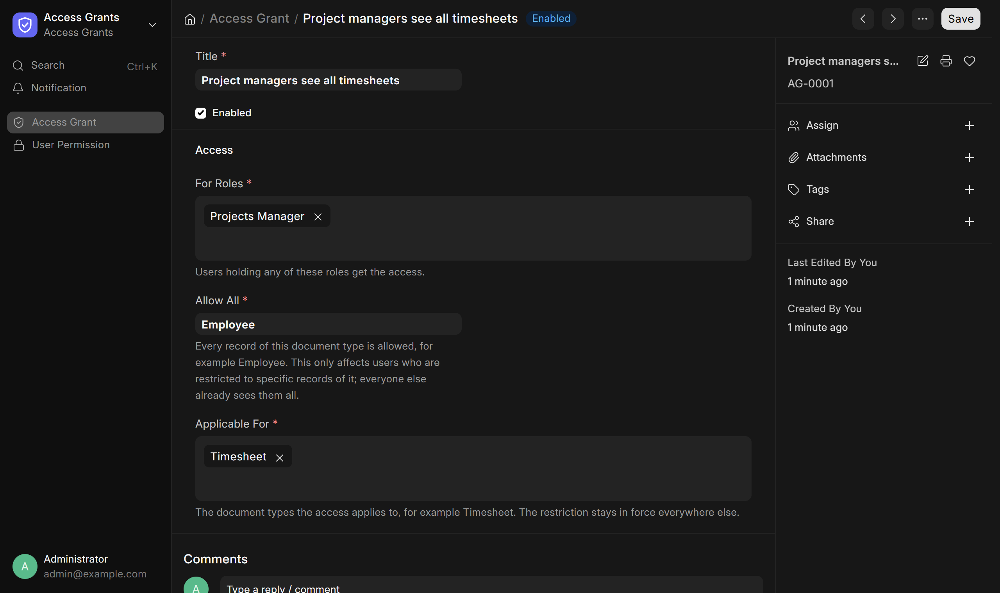
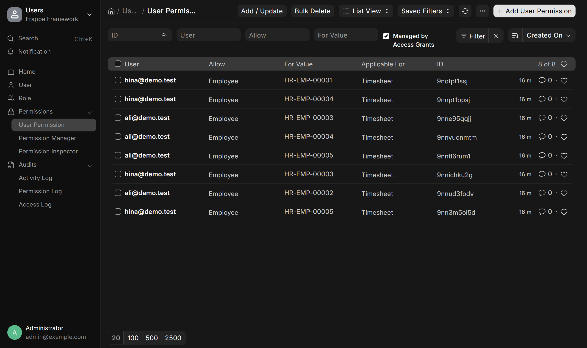

# Frappe Access Grants

Let a role see past a user permission on the document types you choose, without editing User Permissions by hand.

A small layer over Frappe's User Permissions for teams where some roles, such as project managers, need to see other people's records.

Built and maintained by [Grayhat](https://grayhat.studio).

## From one grant to working access

ERPNext restricts each employee's user to their own Employee record, and that restriction follows every document type that links to Employee. A project manager therefore cannot open their team's Timesheets unless someone adds a User Permission per manager, per employee.

An Access Grant replaces that manual work:

```text
Access Grant
  For Roles:       Projects Manager
  Allow All:       Employee
  Applicable For:  Timesheet
  -> one User Permission per manager, per other employee, applicable for Timesheet
  -> Frappe enforces them in lists, forms, reports and the API
```

The restriction stays in force everywhere the grant does not name. The manager above still sees only their own Employee record, leave and salary slips.

## What you can do

- Give several roles access in one grant.
- Apply a grant to several document types at once.
- Use any document type users are restricted by, not only Employee.
- Disable a grant to withdraw its access, and enable it again to restore it.
- See every row the app created by filtering User Permission on **Managed by Access Grants**.
- Keep a row yourself by unticking that field; the app leaves it alone from then on.
- Add your own User Permissions alongside; the app never touches them.

## Requirements

Frappe Framework version 16. ERPNext is not required. CI tests every change against the ERPNext image pinned in [`ci.yml`](.github/workflows/ci.yml), because Employee and Timesheet are the common case.

## Installation

From your bench directory, run:

```bash
bench get-app https://github.com/grayhatdevelopers/frappe_access_grants.git --branch main
bench --site your-site.example install-app access_grants
bench --site your-site.example migrate
```

Installation adds a **Managed by Access Grants** field to User Permission.

## Create a grant

Open **Access Grants** from the desk and add an **Access Grant**:



| Field | Description | Example |
| --- | --- | --- |
| Title | Name of the grant | Project managers see all timesheets |
| For Roles | Users holding any of these roles get the access | Projects Manager |
| Allow All | The document type whose records are all allowed | Employee |
| Applicable For | The document types the access applies to | Timesheet |
| Enabled | Untick to withdraw the access without deleting the grant | Ticked |

Saving the grant creates the rows in the background, usually within a few seconds. Only System Managers can create grants.



A grant only affects users who are restricted to specific records of the **Allow All** document type. Everyone else already sees every record and gets no rows.

## How the rows are kept current

Rows are added and removed when:

- a grant is saved, disabled or deleted;
- a user gains or loses one of its roles, or is disabled;
- a record of the **Allow All** document type is created or deleted;
- the user's own restriction is added or removed.

A daily job repeats the sync for changes that bypass these events, such as direct database writes. A managed row deleted by hand comes back on the next sync; disable the grant to remove its rows.

## Limits

- One row is written per user, per record, per document type. A grant for 10 managers over 200 employees and 2 document types is 4,000 rows.
- ERPNext also restricts employees to their Company. For access across companies, add a second grant that allows all Company records.
- Access is all records or none. A grant cannot be limited to, say, one project's timesheets.

## Development

Run the tests in a disposable Docker bench, as CI does. Set `FRAPPE_IMAGE` to the version in [`ci.yml`](.github/workflows/ci.yml), for example:

```bash
FRAPPE_IMAGE=frappe/erpnext:v16.36.0 tests/docker/run.sh
```

Or from an existing bench that has ERPNext installed:

```bash
bench --site your-site.example run-tests --app access_grants
```

Run formatting and lint checks from the app directory:

```bash
pre-commit install
pre-commit run --all-files
```

Pull requests target `develop` and are squash-merged; titles must be conventional commits.

## Help and project links

- [Issue tracker](https://github.com/grayhatdevelopers/frappe_access_grants/issues)
- [Frappe Framework](https://github.com/frappe/frappe)
- [Grayhat](https://grayhat.studio)

For support and other enquiries, email [info@grayhat.studio](mailto:info@grayhat.studio).

## Contributing

Contributions are welcome. Open an issue to report a bug or discuss a change before submitting a pull request.

## License

Frappe Access Grants is built by [Grayhat](https://grayhat.studio) and released under the [MIT License](LICENSE).
